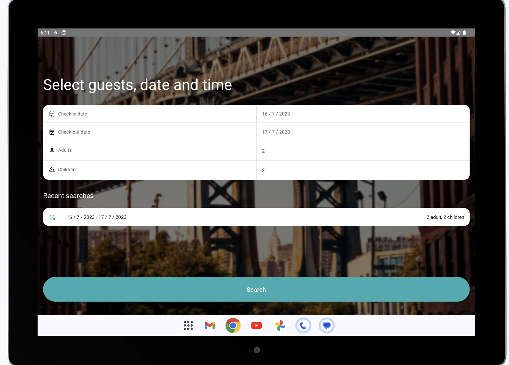

# Shackle Hotel Buddy

## Features

- Endless scrolling
- Survives orientation changes
- Works on tablet and phone
- Keeps a list of recent searches

## Code architecture

- MVVM/MVI
- Jetpack Compose
- Pagination
- Single-activity with NavHost
- Room DB
- Coroutines
- Multi-modular

## Considerations

- The API key is stored in the code, which is highly unsafe - it should be stored locally in a file
  like local.properties to avoid pushing it to VCS. I did this for ease of building and running the
  app - in a production setting, the API key would not be stored in VCS.
- There is no cache timeout/limit for the list of recent searches. Ideally, this would be bounded to
  a small number to avoid endless database growth.
- A UI test would make sense. ComposeTestRule.waitUntil{} would be central to that.
- Not all logic classes are tested, such as the mappers. These tests should be added. I'm hoping
  that the existing tests are a good enough showcase.
- The app size is larger than it should be, because I didn't have time to optimize the modules. This
  can be
  reduced by removing unused libraries, tools like ProGuard, and others.

## Improvements

- Some logic could be abstracted more, e.g. using interfaces for maximum encapsulation
- Date choosing logic does not have enough checks. Some checks include checking that the check out
  date is after the check in date, pre-filling the date if it was chosen before, etc.
- It would be nice to store properties in a database. This would require a many-to-many relationship
  between searches and properties
- Adding a detail screen when a property is clicked would make sense

## Running the app

No extra steps should be needed to run the app. Clone or download the project, open in Android
Studio and run on any device.
