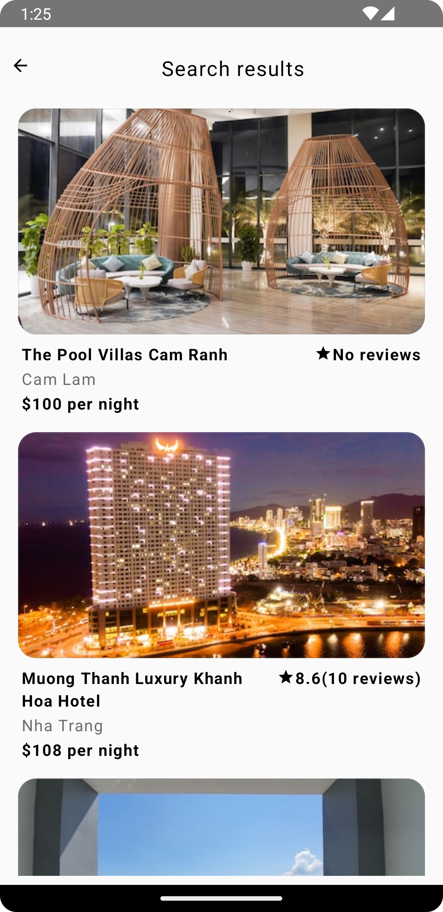

# Shackle Tech Assignment - Hotel Search
This app gives user filter to search hotel and shows list of hotels

## Design Pattern:
Clean Architecture + MVVM (Model View View Model)

## Application Flow:
One activity based app with following 2 screens:

1. Main Search Screen:


2. Hotel List Screen


## Libraries:
- Jetpack Compose
- Jetpack Navigation between composable screens
- Jetpack Lifecycle and View model
- Flow and StateFLows
- Hilt for DI
- Room for local caching of recent searches
- Retrofit with Gson for web services
- Coil for hotel image  
- Mockk for tests
- Robolectric for tests

## Building
Open the project in Android studio. Press run or debug to run on a connected device or an emulator.

## Testing
The project uses local unit tests that run on your computer. On Mac machine with a connected device or an emulator, to run both of them and generate a coverage report, you can run:
```gradlew fullCoverageReport```